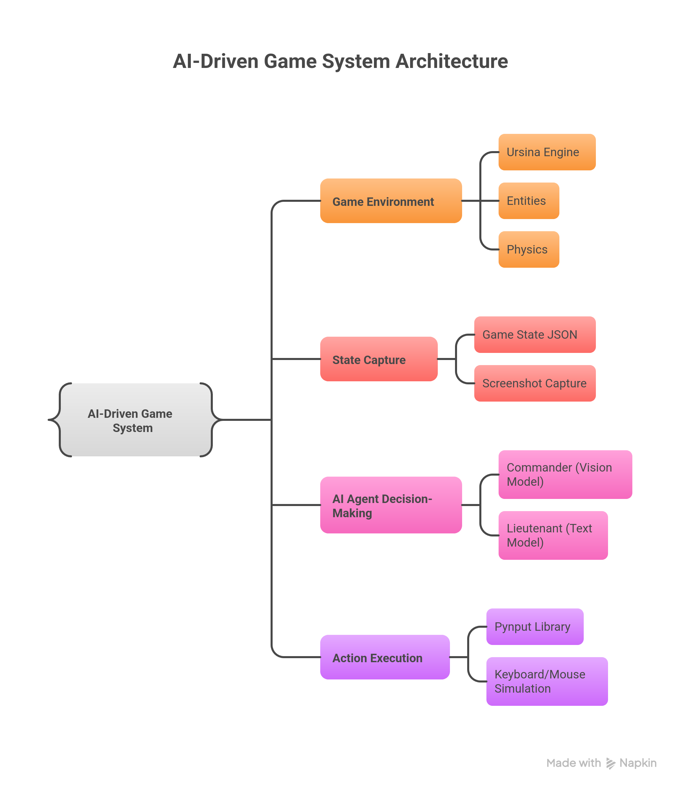

# VisionTactical AI Agent: AI Agent that Plays 3D Shooting Game

    

This project demonstrates an AI agent playing a custom 3D first-person shooting game built with Ursina. The agent uses multimodal LLMs—DeepSeek V3 for text-based tactics and Mistral 3.1 for vision-based strategy—to perceive the environment, decide actions, and win by eliminating enemies while avoiding damage.

Watch the agent in action:
- **Game without AI**: Manual play for testing.

https://github.com/user-attachments/assets/797d1dfc-def3-40c8-9930-55fd84e31abb


  
- **First attempt (failure)**: Agent fails due to fast enemy speed.


https://github.com/user-attachments/assets/4535923e-5ef6-41b9-9379-a6df182a72ee


- **Second attempt (win)**: Agent succeeds after reducing enemy speed.

 

https://github.com/user-attachments/assets/efb02ed6-9582-49f4-93ce-d241e93c632c


## Table of Contents

- [How to Use](#how-to-use)
- [Architecture](#architecture)
- [Setup](#setup)
- [Building the Game](#building-the-game)
- [Building the AI Agent](#building-the-ai-agent)
- [Testing](#testing)
- [Summary and Future Steps](#summary-and-future-steps)

## How to Use

Clone the repo:

```bash
git clone https://github.com/zaineli/vision-tactical
cd VisionTactical
```

Directory structure:
```
SmartShot-ai-agent/
├── agent.py             # AI agent logic
├── game.py              # Game with AI integration
├── game_without_ai.py   # Game for manual testing
├── requirements.txt     # Dependencies
├── README.md            # This guide
```

Install dependencies:

```bash
pip install -r requirements.txt
```

Run the game:

```bash
python game.py
```

Add your API key in `agent.py`:

```python
client = OpenAI(
    base_url="https://api.studio.nebius.com/v1/",
    api_key="YOUR_API_KEY_HERE"
)
```

Run the agent:

```bash
python agent.py
```

Observe actions in the console as the agent plays.

## Architecture

The system uses a multi-agent setup:  
- **Commander** (Mistral 3.1 VLM): Analyzes screenshots and data for high-level strategies (e.g., ENGAGE_AGGRESSIVELY).  
- **Lieutenant** (DeepSeek V3 LLM): Selects immediate actions (e.g., AIM, ATTACK) based on strategy and real-time state.  
- Loop: Perceive (screenshots + JSON state) → Decide → Act (via keyboard/mouse simulation) → Repeat.  



## Setup

Use Python 3.10 in a virtual environment:

```bash
python -m venv venv
source venv/bin/activate  # Or venv\Scripts\activate on Windows
```

Install key libraries:

```bash
pip install openai pynput mss ursina
```

Initialize OpenAI client in code (as shown above). Use Nebius.ai for open-source LLMs.

## Building the Game

We build a simple 3D FPS game from scratch.

1. **Main Window & Ground/Sky**: Initialize Ursina app, add grass plane ground, skybox, and first-person controller (W/A/S/D movement).

   ```python
   from ursina import *
   from ursina.prefabs.first_person_controller import FirstPersonController

   app = Ursina()
   ground = Entity(model='plane', scale=64, texture='grass', collider='box')
   Sky()
   player = FirstPersonController(y=2, origin_y=-.5, speed=8)
   # ... (add more entities)
   app.run()
   ```

2. **Weapon**: Add a cube gun with muzzle flash and shooting logic (left-click fires, damages enemies).

   ```python
   gun = Entity(model='cube', parent=camera, position=Vec3(.5, -0.25, .25), scale=Vec3(.3, .2, 1), color=color.red, on_cooldown=False)
   gun.muzzle_flash = Entity(parent=gun, z=1, world_scale=.5, model='quad', color=color.yellow, enabled=False)

   def shoot():
       if not gun.on_cooldown:
           # Flash, sound, damage logic...
           if mouse.hovered_entity and hasattr(mouse.hovered_entity, 'hp'):
               mouse.hovered_entity.hp -= 10

   def update():
       if held_keys['left mouse']: shoot()
   ```

   (Option: Use .obj models like AK-47 for realism.)

3. **Environment Improvements**: Add random brick walls and sunlight with shadows.

   ```python
   import random
   from ursina.shaders import lit_with_shadows_shader
   Entity.default_shader = lit_with_shadows_shader
   sun = DirectionalLight(); sun.look_at(Vec3(1, -1, -1))

   for i in range(16):
       Entity(model='cube', texture='brick', x=random.uniform(-8,8), z=random.uniform(-8,8)+8, collider='box', scale_y=random.uniform(2,3))
   ```

4. **Enemies & Health**: Create chasing enemies (cubes with health bars) that damage player on contact. Add player health bar.

   ```python
   class Enemy(Entity):
       def __init__(self, **kwargs):
           super().__init__(model='cube', scale_y=2, color=color.light_gray, collider='box', **kwargs)
           self.health_bar = Entity(parent=self, y=1.2, model='cube', color=color.red, world_scale=(1.5,.1,.1))
           self.max_hp = 100; self.hp = 100

       def update(self):
           # Chase player if visible, attack if close...
           if dist <= 2 and not self.attack_cooldown:
               player.hp -= 20
               # Update health bar...

   enemies = [Enemy(x=x*4) for x in range(4)]
   player_health_bar = HealthBar(bar_color=color.lime.tint(-.25), value=player.hp, max_value=player.max_hp)
   ```

## Building the AI Agent

1. **Capture State**: Save game data (health, positions, visibility via raycast) to JSON; capture screenshots with MSS.

   ```python
   import json, math, mss, base64

   # Calculate aiming error...
   aiming_error = # math logic...

   hit_info = raycast(player.world_position + player.camera_pivot.up, camera.forward, 100, ignore=(player,))
   is_enemy_visible = hit_info.entity == enemy

   game_data = {"player_health": player.hp, ...}  # Full dict
   with open("game_state.json", "w") as f: json.dump(game_data, f)

   def capture_screen_as_base64():
       with mss.mss() as sct:
           # Grab and encode screen...
   ```

2. **Action Decider**: Use Pynput for keyboard/mouse control; define actions like AIM, ATTACK.

   ```python
   from pynput.keyboard import Controller as KeyboardController
   from pynput.mouse import Button, Controller as MouseController

   keyboard = KeyboardController(); mouse = MouseController()

   def execute_command(command, game_state):
       # Mouse/keyboard logic for each command...
   ```

3. **DeepSeek Sub-Agent (Lieutenant)**: LLM selects tactical actions based on strategy.

   ```python
   text_model_id = "deepseek-ai/DeepSeek-V3"

   def get_tactical_action_from_llm(strategy, game_state):
       # Prompt LLM, get action like 'ATTACK'...
   ```

4. **Mistral Sub-Agent (Commander)**: VLM sets strategy from screenshot + data.

   ```python
   vision_model_id = "mistralai/Mistral-Small-3.1-24B-Instruct-2503"

   def get_strategic_goal_from_vlm(game_state, screenshot_base64):
       # Prompt VLM, get strategy like 'ENGAGE_AGGRESSIVELY'...
   ```

5. **Main Logic**: Loop integrates components (perceive, decide, act).

   ```python
   import time

   while True:
       game_state = read_game_state()
       if game_state.get('game_status') in ['won', 'lost']: break

       if time.time() - last_strategic_update_time > 1.0:
           screenshot = capture_screen_as_base64()
           current_strategic_goal = get_strategic_goal_from_vlm(game_state, screenshot)

       tactical_action = get_tactical_action_from_llm(current_strategic_goal, game_state)
       execute_command(tactical_action, game_state)
       time.sleep(0.3)
   ```

## Testing

Test manually with `game_without_ai.py`. For AI: Run `game.py` and `agent.py`. Agent fails initially due to enemy speed but wins after adjustment (see videos above).

Hiding behind walls works; enemies chase via raycast but stop if blocked.

## Summary and Future Steps

Built a 3D FPS game and multimodal AI agent that plays autonomously. Agent perceives via JSON/screenshots, strategizes with VLM, acts with LLM.

Future: Add obstacles (trees, cars), parallel LLM processing for faster reactions, multi-enemy support.
<- Add quickstart guide for setup and commit: 2025-11-04 -->

<- Add quickstart guide for setup and commit: 2025-11-05 -->

<- Add quickstart guide for setup and commit: 2025-11-06 -->

<- Add quickstart guide for setup and commit: 2025-11-07 -->

<- Add quickstart guide for setup and commit: 2025-11-08 -->
